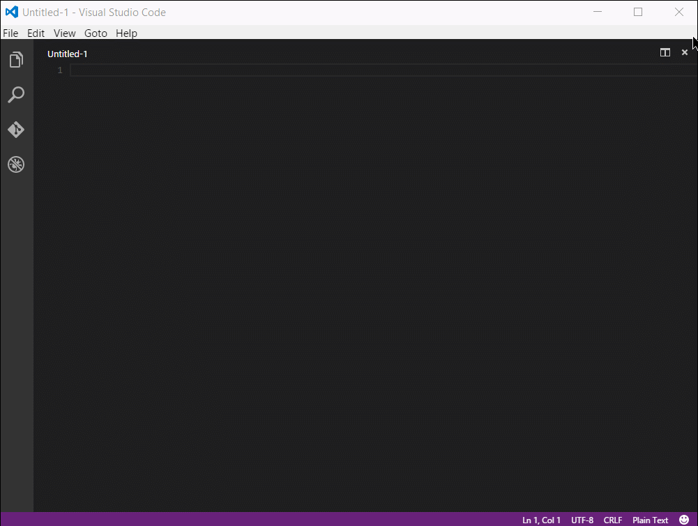
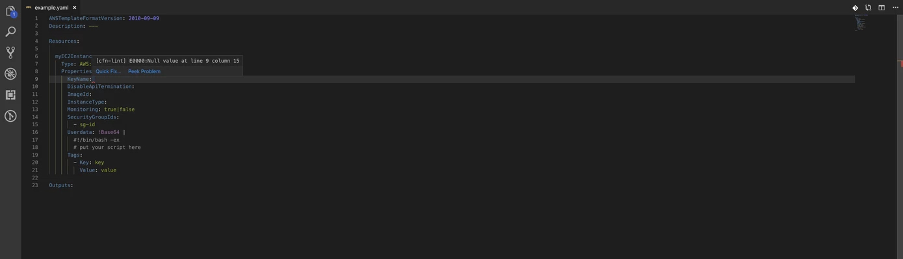
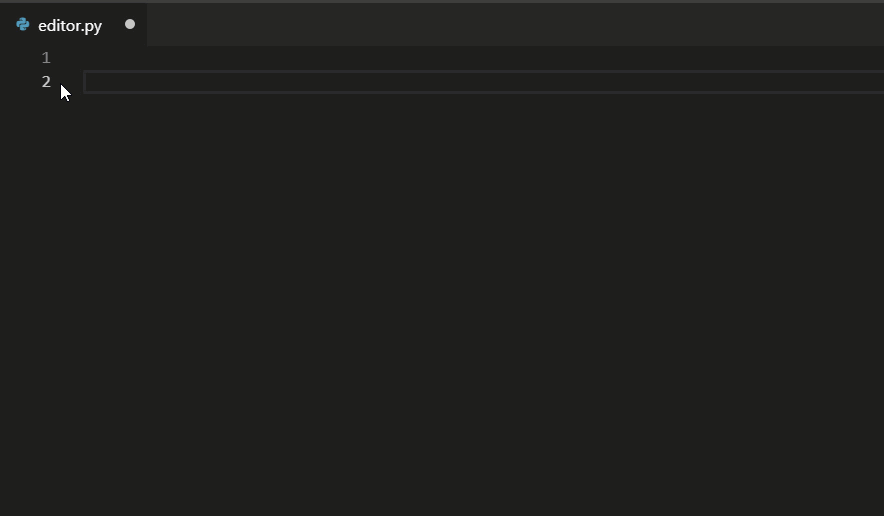
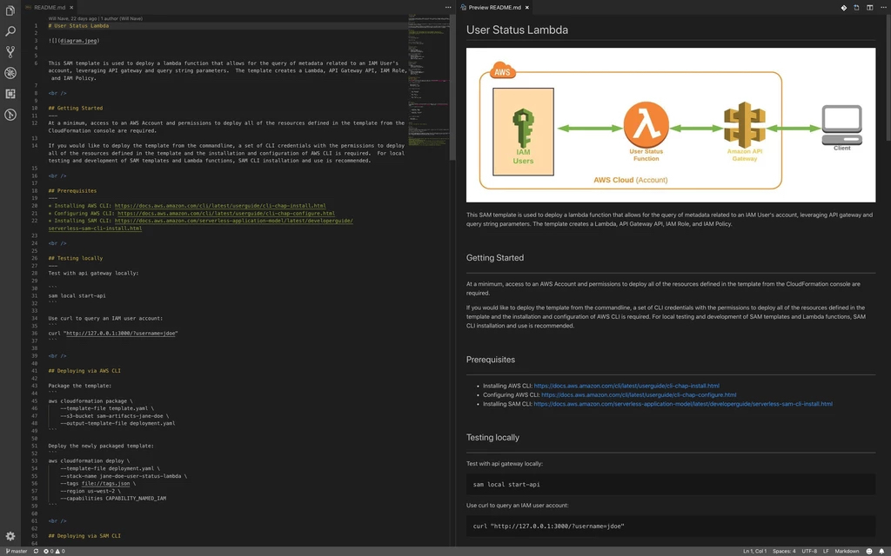
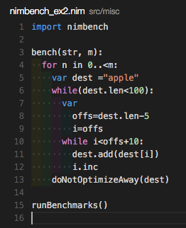
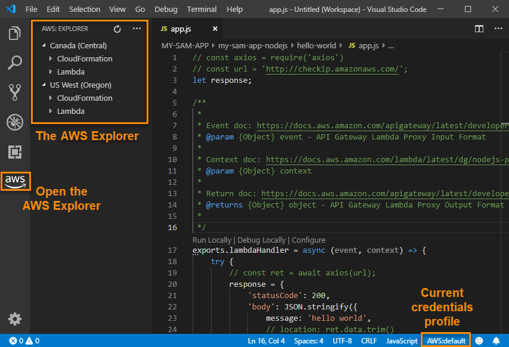

# Optimize Visual Studio Code for AWS

This article is a walkthrough of configuring Visual Studio Code to optimize the IDE for working with AWS tools and resources.  The following content will cover a series of recommended extensions and configuration customizations that will improve authoring of CloudFormation templates, as well as authoring of Lambda Functions.

<br />

## Prerequisites
---
Prior to installing and configuring Visual Studio Code, you will want to install the following tools:

* Install AWS CLI: https://docs.aws.amazon.com/cli/latest/userguide/cli-chap-install.html
* Install AWS Shell (optional): https://github.com/awslabs/aws-shell
* Install CFN Lint: https://github.com/aws-cloudformation/cfn-python-lint

<br />

## Install Visual Studio Code
---
Download and install the binary for your operating system: https://code.visualstudio.com/

>*All available packages: https://code.visualstudio.com/download*

* Getting Started Intro: https://code.visualstudio.com/docs
* Language Support Overview: https://code.visualstudio.com/docs/languages/overview
* Browsing and Installing Extensions: https://code.visualstudio.com/docs/editor/extension-gallery

<br />

## Visual Studio Code Extensions
---
### CloudFormation Extension (https://github.com/aws-scripting-guy/cform-VSCode)

>The CloudFormation extension for Visual Studio Code simplifies the authoring of CloudFormation templates in JSON or YAML by automating the generation of a basic template structure, as well as providing boilerplate resource definitions based on each unique CloudFormation resource type.  The CloudFormation extension has a direct dependency on the RedHat YAML linting extension. However, as a part of the CloudFormation extension installation, the RedHat YAML extension will be installed during the installation of the CloudFormation extension. .
>
>1. Install the extension
>2. Create a new YAML or JSON file
>3. Ensure syntax is set to JSON or YAML
>4. Type start and press the tab key to pre-populate a basic template structure
>5. Begin typing the desired resource name and hit the tab key to pre-populate a boilerplate resource definition.
>
>
>
>
>>To prevent the RedHat YAML extension from flagging CloudFormation intrinsic >>function references as errors you will need to perform the following customizations >to your VSCode settings configuration (settings.json)
>>
>>1. Open User Settings by pushing "`ctrl + ,`" on Windows, or "`cmd + ,`" on Mac.
>>2. In the top right corner click the `{}` icon.
>>3. Paste the following text into the json file to remove errors associated with the CloudFormation Intrinsic function references:
>>```
>>// Custom tags for the parser to use
>>"yaml.customTags": [
>>    "!And Scalar",
>>    "!And Sequence",
>>    "!If Scalar",
>>    "!If Sequence",
>>    "!Not Scalar",
>>    "!Not Sequence",
>>    "!Equals Scalar",
>>    "!Equals Sequence",
>>    "!Or Scalar",
>>    "!Or Sequence",
>>    "!FindInMap Scalar",
>>    "!FindInMap Sequence",
>>    "!Base64",
>>    "!Cidr",
>>    "!Ref",
>>    "!Sub Scalar",
>>    "!Sub Sequence",
>>    "!GetAtt",
>>    "!GetAZs",
>>    "!ImportValue",
>>    "!Select Scalar",
>>    "!Select Sequence",
>>    "!Split Scalar",
>>    "!Split Sequence",
>>    "!Join Scalar",
>>    "!Join Sequence",
>>],
>>// Enable/disable default YAML formatter (requires restart)
>>"yaml.format.enable": true
>>```


<br />

### vscode-cfn-lint Extension (https://github.com/awslabs/aws-cfn-lint-visual-studio-code)

>The vscode-cfn-lint extension leverages the python-based cfn-lint cli tool for linting CloudFormation templates.
>
>1. Ensure CFN Lint tool is installed (*see prerequisites section above*)
>2. Install vscode-cfn-lint extension
>
>

<br />

### Python Extension (https://code.visualstudio.com/docs/languages/python)
>The Python extension provides linting, debugging (multi-threaded, remote), Intellisense, code formatting, refactoring, unit tests, snippets, and more for both Python 2.7 and Python 3.4+.  The only prerequisites for the extension are the installation of a supported version of Python.  If you have Python installed the extension can be found and installed from within Visual Studio Code Extensions.  The Python extension is a must for developing any Python-based Lambda code.
>
>
>
>Getting started with Python in VSCode: https://code.visualstudio.com/docs/python/python-tutorial

<br />

### Markdown All in One Extension (https://github.com/yzhang-gh/vscode-markdown)
>The Markdown All in One Extensions makes it considerably easier to author documentation for your source code repositories.  It associates text editing and formatting commands you are familiar with in popular word processors with their equivalent formatting syntax in Markdown.  This extension has no prerequisites and is easily installed from within Visual Studio Code Extensions.
>
>

<br />

### GitLens extension (https://marketplace.visualstudio.com/items?itemName=eamodio.gitlens)
>GitLens supercharges the Git capabilities built into Visual Studio Code. It helps you to visualize code authorship at a glance via Git blame annotations and code lens, seamlessly navigate and explore Git repositories, gain valuable insights via powerful comparison commands, and so much more.
>
>

<br />

Indent Rainbow (https://marketplace.visualstudio.com/items?itemName=oderwat.indent-rainbow)
>A simple extension to make indentation more readable
>
>

<br />

AWS Toolkit (https://aws.amazon.com/visualstudiocode/)
> The AWS Toolkit for Visual Studio Code is an open source plug-in for the Visual Studio Code that makes it easier to create, debug, and deploy applications on Amazon Web Services.
>
>

<br />
